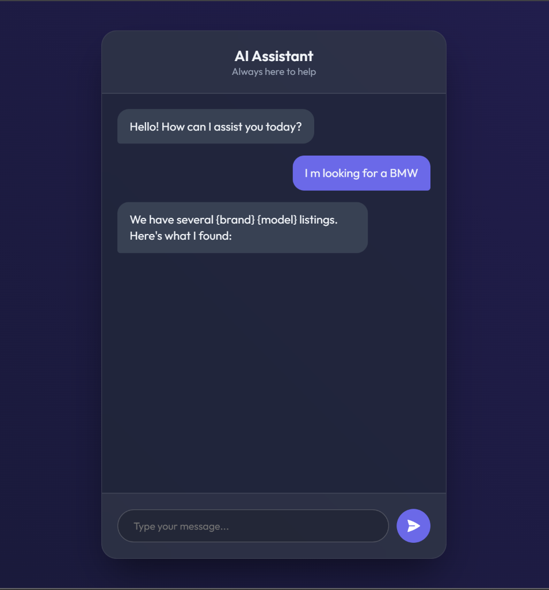
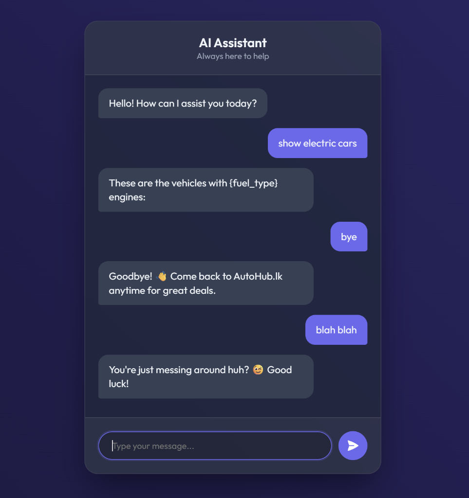
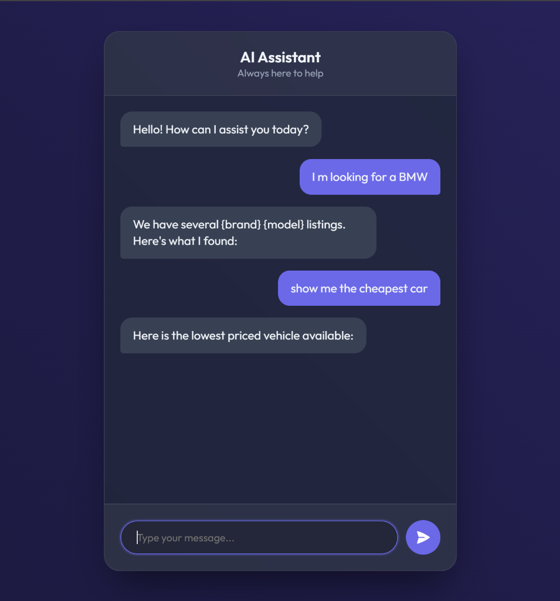

# PitStop-Assistant 🚗💨

**PitStop-Assistant** is an intelligent conversational agent designed specifically for automotive marketplaces. It bridges the gap between buyers and sellers by streamlining vehicle inquiries, valuation, and lead generation. This bot leverages Natural Language Processing (NLP) to understand user intent, making the car buying and selling process smoother and more interactive.

## 🌟 Key Features

*   **Smart Vehicle Search**: Filter cars by make, model, year, and budget through natural conversation.
*   **Seller Assistance**: Automated intake for users looking to sell or trade-in their vehicles.
*   **Instant Valuation**: Integrated logic to provide estimated market values for used cars.
*   **Secure Authentication**: Built-in user registration and login system to save preferences.
*   **Responsive UI**: Fully optimized web interface for mobile and desktop buyers.

## 🚀 Tech Stack

*   **Frontend**: HTML5, CSS3, JavaScript, Jinja2 Templates
*   **Backend**: Python, Flask, Flask-SQLAlchemy
*   **AI/NLP**: Scikit-Learn, NLTK (TF-IDF Vectorization & Logistic Regression)
*   **Database**: SQLite (Development) / PostgreSQL (Production)
*   **Deployment**: Render

## 🛠️ Installation & Setup

Follow these steps to get the project running on your local machine.

### Prerequisites

*   Python 3.8+
*   Git

### 1. Clone the repository

```bash
git clone https://github.com/yourusername/pitstop-assistant.git
cd pitstop-assistant
```

### 2. Create and activate a Virtual Environment

**Windows:**
```bash
python -m venv venv
.\venv\Scripts\activate
```

**macOS/Linux:**
```bash
python3 -m venv venv
source venv/bin/activate
```

### 3. Install Dependencies

```bash
pip install -r requirements.txt
```

### 4. Train the AI Model

Before running the application, you need to train the NLP model using the provided training script.

```bash
python train.py
```
*This will generate `chatbot_model.pkl` and `label_encoder.pkl` required for the bot to function.*

### 5. Run the Application

```bash
python app.py
```

The application will start on `http://127.0.0.1:5000/`.

## 📈 Use Case Examples

**Buyer:**
> "I'm looking for a used SUV under $20,000 with less than 50k miles."
> *The bot filters the database and returns matching listings.*

**Seller:**
> "I want to sell my 2018 Honda Civic. What is its current market value?"
> *The bot asks for condition details and provides a price estimate.*

## 📸 Screenshots

Here is a glimpse of **PitStop-Assistant** in action:

<div align="center">
  
  
</div>
<br>
<div align="center">
  
  
</div>


